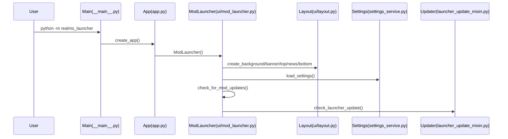

## Realms Launcher – Developer Architecture & Logic

This document explains **how the launcher works**, where the logic lives, and the main runtime flows.

### High-level responsibilities

- **UI (Tkinter)**: window creation, widget layout, button wiring, UI state transitions.
- **Services**: network calls, install/update orchestration, registry persistence, launching the game, shortcut creation.
- **Utilities**: runtime detection (frozen vs dev), logging, process spawning helpers.

### Entrypoints (how the app starts)

- **Dev / module entrypoint**: `src/realms_launcher/__main__.py`
  - Configures logging and runs `create_app().mainloop()`.
- **App factory**: `src/realms_launcher/app.py`
  - `create_app()` returns `ModLauncher()` from `src/realms_launcher/ui/window.py`.
- **Stable UI import surface**: `src/realms_launcher/ui/window.py`
  - Compatibility shim that re-exports `ModLauncher` so imports remain stable.
- **Composition root**: `src/realms_launcher/ui/mod_launcher.py`
  - Defines `class ModLauncher(...)` as `tk.Tk` + mixins, and runs layout creation + initial checks.

### Module map (where things live)

#### UI layer (`src/realms_launcher/ui/`)

- **Layout builder**: `ui/layout.py`
  - Creates the widgets and stores them on `self` (e.g. `bg_canvas`, `download_button`, `status_label`).
  - Wires button commands to `self.select_folder()`, `self.download_and_extract_mod()`, `self.launch_game()`, etc.
- **Assets & UI helpers**
  - `ui/assets.py`: resolves resource paths (dev + PyInstaller `_MEIPASS`).
  - `ui/ani.py`: parses Windows `.ani` and returns `(frames, delays_ms)`.
  - `ui/cursors.py`: best-effort cursor setting for `.cur`/`.ani`.
  - `ui/effects.py`: canvas/button visuals (shadows, glow, hover styling, icon animation).
- **Window logic (via mixins)**: `ui/mixins/`
  - `admin_mixin.py`: admin privilege prompting + “quit for update”.
  - `ui_helpers_mixin.py`: delegates to `layout/effects/cursors/assets/ani` and contains `update_download_button_icon()`.
  - `state_mixin.py`: registry load/save + mod status checks + “Retry” state.
  - `button_visibility_mixin.py`: show/hide buttons and positioning logic.
  - `actions_mixin.py`: install/update flow, language switching, launch, uninstall, shortcuts.
  - `launcher_update_mixin.py`: launcher self-update check and apply flow.

#### Service layer (`src/realms_launcher/services/`)

- **Remote metadata & version comparison**: `services/version_service.py`
  - `fetch_remote_version_info()` reads `MOD_INFO_URL` and returns:
    - `version` (Realms version)
    - `launcher_version`
    - `required_aotr_version`
  - `is_latest_newer()` and `is_lower_version()` compare versions numerically by dot segments.
- **News**: `services/news_service.py`
  - Fetches `NEWS_URL` and returns HTML or a fallback snippet.
- **Mod status**: `services/realms_service.py`
  - Reads local `realms_version.json` and compares with remote `version`.
  - Returns a structured status (not installed / update available / up-to-date / check failed).
- **Install/update workflow**: `services/realms_install_service.py`
  - Ensures AOTR compatibility (reads local `lotr.str` via `services/aotr_service.py`).
  - If needed downloads and extracts `aotr.rar` (RAR extraction depends on external tools installed).
  - Installs base/update ZIP overlays via `services/install_service.py`.
  - Writes `realms/realms_version.json`.
  - Deletes selected map folders post-install.
  - Uses callbacks for UI feedback:
    - `on_status(message, fg_color)`
    - `on_progress_pct(pct_0_to_100)`
- **ZIP overlay primitive**: `services/install_service.py`
  - Downloads ZIP, extracts, then overlays files into the destination directory.
- **Game launch**: `services/game_service.py`
  - Launches `rotwk/lotrbfme2ep1.exe -mod "<install_path>/realms"`.
  - Copies `realms/dxvk/dxvk.conf` into `rotwk/dxvk.conf` if present.
- **Shortcuts**: `services/shortcut_service.py`
  - Creates Desktop `.lnk` with versioned name `Realms in Exile vX.Y.Z.lnk`.
- **Settings (registry)**: `services/settings_service.py`
  - Persists and loads:
    - `InstallFolder` (string)
    - `Installed` (DWORD 0/1)
    - `Language` (string)
  - Registry location: `REG_PATH` in `src/realms_launcher/constants.py`.
- **Launcher self-update**: `services/launcher_update_service.py`
  - Downloads update ZIP to a staging folder.
  - Writes updater scripts via `services/updater_scripts.py`.
  - Spawns updater (elevated if needed) and quits the launcher so files can be replaced and relaunch can occur.

### Data model (local state)

#### Installation folder layout

The launcher expects the selected `install_path` to contain:

- `install_path/aotr/` (AOTR base mod)
- `install_path/realms/` (Realms overlay folder; created/updated by the launcher)
- `install_path/rotwk/lotrbfme2ep1.exe` (game executable)

#### Local version file

- `install_path/realms/realms_version.json`
  - Shape: `{"version": "x.y.z"}`

#### Registry keys (HKCU)

- Key path: `REG_PATH` (`src/realms_launcher/constants.py`)
- Values:
  - `InstallFolder` (string)
  - `Installed` (DWORD)
  - `Language` (string)

### Remote endpoints

Defined in `src/realms_launcher/constants.py`:

- **Remote metadata JSON**: `MOD_INFO_URL`
- **News HTML**: `NEWS_URL`
- **Packages**:
  - `BASE_MOD_ZIP_URL`
  - `UPDATE_ZIP_URL`
  - `AOTR_RAR_URL`
- **Launcher update zip**: `LAUNCHER_ZIP_URL`

### Main flows

#### Startup flow

#### Folder selection

1. User selects a folder (directory picker).
2. UI validates it contains `aotr/`.
3. Registry is updated (`Installed = 0`).
4. UI triggers `check_for_mod_updates()` to decide which buttons to show.

#### “Check for updates” (Realms)

Owned by: `ui/mixins/state_mixin.py` + `services/realms_service.py`

1. UI switches download button to “Checking…”.
2. Service reads local version file (if any) and fetches remote metadata.
3. UI transitions into one of these states:
   - **not_installed**: enable “Download Mod”; disable uninstall/shortcut/language.
   - **update_available**: enable “Download Update”; enable uninstall/shortcut/language.
   - **up_to_date**: show “Play”; enable uninstall/shortcut/language.
   - **check_failed**: show “Retry”; disable uninstall/shortcut/language.

#### Install / Update (download button)

Owned by: `ui/mixins/actions_mixin.py` + `services/realms_install_service.py`

1. UI hides folder/download/play buttons and shows progress bar.
2. Service:
   - checks AOTR required version vs installed version
   - downloads/extracts AOTR RAR if needed
   - installs base ZIP and optional update ZIP
   - writes `realms_version.json`
3. UI saves registry with `Installed = 1` and re-runs `check_for_mod_updates()`.

#### Launch game

Owned by: `ui/mixins/actions_mixin.py` + `services/game_service.py`

1. Builds `-mod "<install_path>/realms"` command.
2. Launches RotWK.
3. Minimizes the launcher window.

#### Uninstall

Owned by: `ui/mixins/actions_mixin.py`

1. Deletes `install_path/realms/` only.
2. Removes desktop shortcuts matching `Realms in Exile v*.lnk`.
3. Clears registry install state and resets UI.

#### Launcher self-update

Owned by: `ui/mixins/launcher_update_mixin.py` + `services/launcher_update_service.py`

1. Fetch remote metadata and compare `LAUNCHER_VERSION`.
2. If update exists and user confirms:
   - download update ZIP → extract to staging
   - write updater `.cmd`/`.ps1`
   - spawn updater (may request elevation)
   - quit launcher so files can be replaced
   - updater relaunches launcher

### Debugging pointers

- **UI widget creation issues**: start at `ui/layout.py` (most widgets are created there).
- **Download/progress issues**: `services/install_service.py` and `services/realms_install_service.py`.
- **Wrong mod state / buttons**: `ui/mixins/state_mixin.py` + `services/realms_service.py`.
- **Self-update issues**: `services/launcher_update_service.py` + `services/updater_scripts.py`.
- **Asset path issues**: `ui/assets.py` and how `resource_path()` resolves under PyInstaller.

